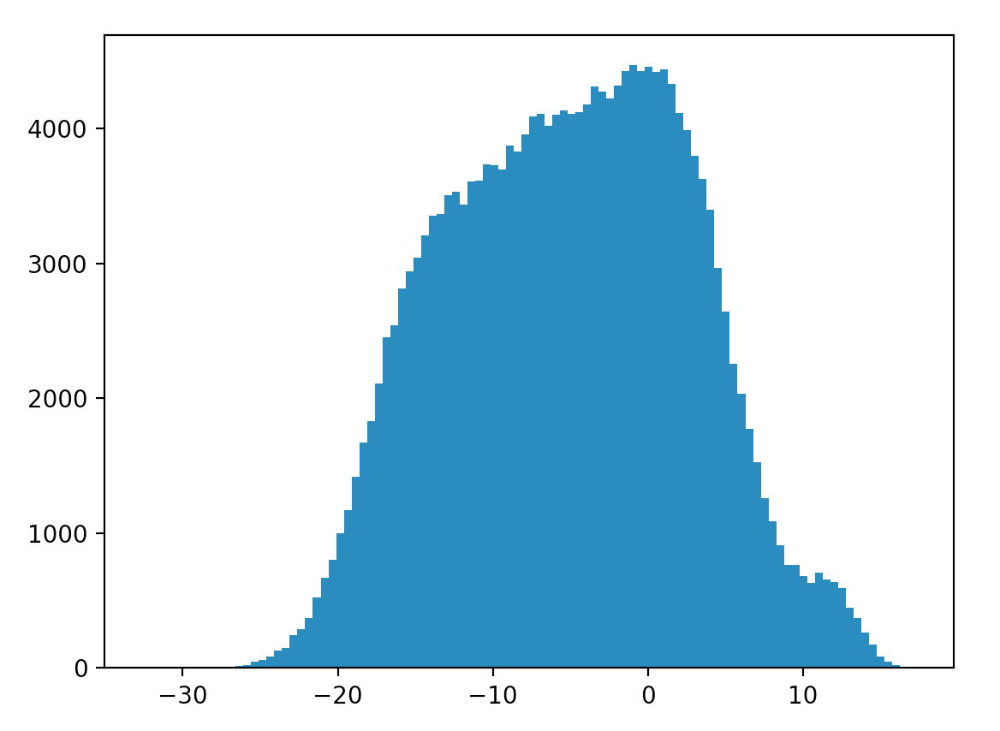
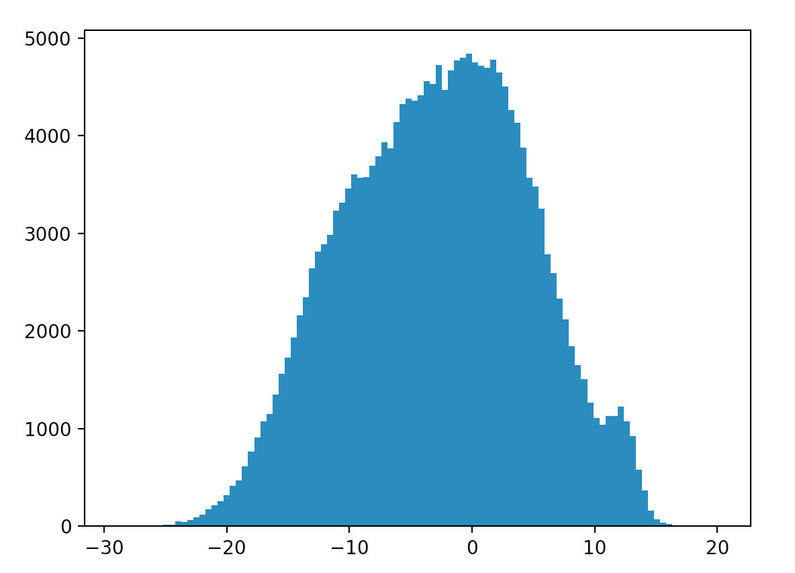

### Data Analysis

> Methods

1. T-sne and visualization

    Random sample some data and use T-sne to reduce the dimensions, then visualize the data

     Sample 500 data  
    

     Sample 1000 data  
    

2. K-means

    Actually, after seeing the results of visualization, I consider K-means will not work. But since I have planned it, I am going to keep on testing the effect of Kmeans. 

    Random sample some data, use Kmeans, and then T-sne and visualize the data.

     Sample 500 data  
    

     Sample 1000 data  
    

    From the pictures above, we can see that the points (target == 1)  have many different colors (each color stands for a category). It means Kmeans does not work in this dataset.

3. Spectral clustering

    Next, I try the spectral clustering. Unfortunately, it does not work, either.

    Random sample some data, use Spectral clustering, and then T-sne and visualize the data.

     Sample 500 data  
    

     Sample 1000 data  
    

4. PCA

    Random sample some data, use PCA and visualize the data.

     Sample 500 data  
    

     Sample 1000 data  
    

    From the pictures above, we can see that PCA does not make any improvements compared with the original data.

5. LDA

    Random sample some data, use LDA and visualize the data.

     Sample 500 data  
    

     Sample 1000 data  
    

    From the pictures above, we can see that LDA can clearly help classify the data.

    Notice: the dimension after LDA is 1

> Todo

1. Range of every feature

    Please see the details of the result in [results/range_of_every_features.md](results/range_of_every_features.md)

    

    The red line shows the minimum value of the features and the blue line shows the maximum value of the features. Each value on X axis represents a kind of feature, and the value on Y axis represents the value of the feature corresponding to the x feature.

    From the picture above, we can see that the ranges among different features are quite different. Thus, we better need to normalize the ranges before applying the data to the models.

2. Histogram of every feature

    Since 200 features are too much to show, I merely random choose some of them to show their histogram so that I can get to know their distributions.

    
     
    
     
    
     

    From the pictures above, we can see that, although the range of every feature is different, their distributions almost match the normal distribution.

> Other Analysis Results

>- Label Type: 0, 1

>- Number of Features: 200

>- Total Number: 200,000

>- Number (target == 1): 20,098
